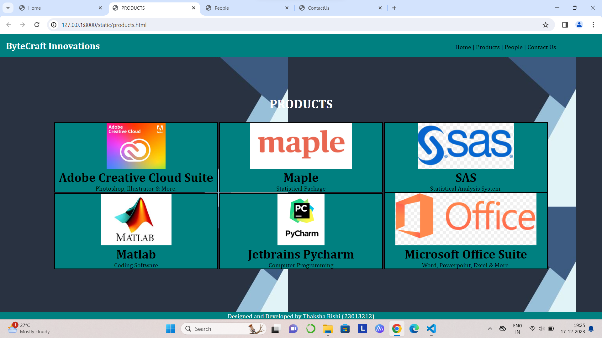
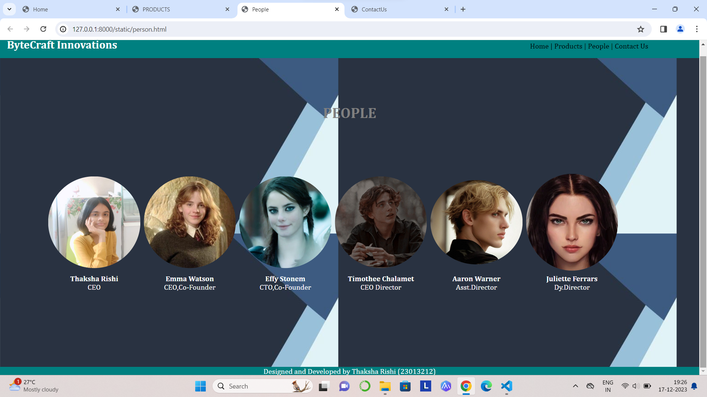

# Ex.07 Software Product Company Website
## Date:17.12.2023

## AIM:
To develop a static company website to display the softwares and services provided by the company.

## DESIGN STEPS:

### Step 1:
Requirement collection.

### Step 2:
Creating the layout using HTML and CSS.

### Step 3:
Updating the sample content.

### Step 4:
Choose the appropriate style and color scheme.

### Step 5:
Validate the layout in various browsers.

### Step 6:
Validate the HTML code.

### Step 7:
Publish the website in the given URL.

## PROGRAM:
```
home.html
<!DOCTYPE html>
<html lang="en">
<head>
    <meta charset="UTF-8">
    <meta name="viewport" content="width=device-width, initial-scale=1.0">
    <title>RT_Home</title>
    <style>
        *{
            margin:0;
            padding:0
        }
        #nav{
            background-color:teal;
            color:white;
            padding: 15px;
    
        }
        li,h1,ul{
            display:inline;
        }
        ul{
            margin-left:60%;
        }
        a{
            color:black;
            text-decoration: none;
        }
        a:hover{
            color:white;
            cursor:pointer;
        }
        input{
            width: 60%;
            padding: 15px;
        }
            .searchbar{
            padding:50px;
            text-align: center;
        }
        
        .box {
            display:inline-block;
            border-style:dotted ;
            border-radius: 10px;
            border-color: yellow;
            width: 400px;
            min-height: 300px;
            font-size: 20px;
            background-color:teal;
        
        }
        .heading1{
            color:black;
            text-align: center;
            padding-top: 20px;
        }
        .heading2{
            color:rgb(255, 255, 255);
            text-align: justify;
            font-size: 30px;
            margin-left: 30px;
        }
        .edge{
            padding-left: 900px;
        }
        .box{
            text-align: center;
        }
        .bottomdiv{
            background-color:teal;
            color:white;
            text-align: center;
            position:fixed;
            bottom:0;
            width:100%;

        }
        table{
            margin-left: 40px;
        }
    </style>
</head>
<body background="background.jpeg">
    <div class="header">
        <nav id="nav">
            <h1>
                ResonanceTech
            </h1>
                <ul>
                    <li class="li1"> 
                        <a href="home.html" target="_blank">Home  |</a>
                    </li>
                    <li class="li2"> 
                        <a href="products.html" target="_blank">Products  |</a>
                    </li>
                    <li class="li4"> 
                        <a href="person.html" target="_blank">People  |</a>
                    </li>
                    <li class="li5"> 
                        <a href="contactus.html" target="_blank">Contact Us</a>
                    </li>
                </ul>
        </nav>
    </div>
    <div class="searchbar">
    <input placeholder="Search">
    </div>
        <div><pre class="heading2"><b>
"Shaping Sonic Brilliance- Elevating
your audio encounters with
precision and passion."<b></pre></div>
        <div class="edge">
            <div class="box">
                <div class="login">
                    <form>
                        <h3>Login Here</h3>
                        <input type="text" placeholder="Username or Email"><br><br>
                        <input type="password" placeholder="Password"><br><br><br>
                        <button>Login</button>
                        <h5>Don't have an account?</h5><br>
                        <div class="Signup"><b><a href="" >Sign up</a></b> here</div>
                        <h5>Login with</h5>
                        <div class="image">
                            
                            
                            
                            
                        </div>
            
                </div>
            </div>
        </div>
    <div class="bottomdiv">
        <p>Designed and Developed by Thaksha Rishi (23013212)</p>
    </div>
</body>
<html>

 products.html
<!DOCTYPE html>
<html lang="en">
<head>
    <meta charset="UTF-8">
    <meta name="viewport" content="width=device-width, initial-scale=1.0">
    <title>RT_Products</title>
    <style>
        *{
            margin:0;
            padding:0;
            font-family:Cambria, Cochin, Georgia, Times, 'Times New Roman', serif;
        }
        #nav{
            background-color:teal;
            color:white;
            padding: 15px;
    
        }
        li,.heading1,ul{
            display:inline;
        }
        ul{
            margin-left:60%
        }
        li{
            color:black;
        }
        li:hover{
            color:white;
            cursor:pointer;
        }
        input{
            width: 60%;
            padding: 15px;
        }
            .searchbar{
            padding:50px;
            text-align: center;
        }
        .box{
            border-color:black;
            border-width:2px;
            border-style:solid;
            display: inline-block;
            width: 414px;
        }
        .product{

            text-align: center;
        }
        .box{
            background-color:teal;
            cursor:pointer;
        }
        a{
            color:black;
            text-decoration: none;
        }
        a:hover{
            color:white;
            cursor:pointer;
        }
        .heading2{
            padding-top: 100px;
            padding-bottom: 10px;
            text-align: center;
            color:white;
        }
        .bottomdiv{
            background-color:teal;
            color:white;
            text-align: center;
            position:fixed;
            bottom:0;
            width:100%;
        }
    </style>
</head>
<body background="background.jpeg">
    <div class="header">
        <nav id="nav">
            <h1 class="heading1">ResonanceTech</h1>
                <ul>
                    <li class="li1"> 
                        <a href="home.html" target="_blank">Home  |</a>
                    </li>
                    <li class="li2"> 
                        <a href="products.html" target="_blank">Products  |</a>
                    </li>
                    <li class="li4"> 
                        <a href="person.html" target="_blank">People  |</a>
                    </li>
                    <li class="li5"> 
                        <a href="contactus.html" target="_blank">Contact Us</a>
                    </li>
                </ul>
            </nav>
        </div>
        <h1 class="heading2">PRODUCTS</h1>
        <br>
        <div class="product">
            <div class="box">
                
                <h1>InfinityNeck</h1>
                <p>Elevate your audio experience with style and comfort. Unleash seamless sound anytime, anywhere with this sleek neckband. </p>
            </div>
            <div class="box">
                
                <h1>PulsePods</h1>
                <p>Unleash Pure Sound Freedom. Immerse yourself in the rhythm of wireless brilliance with PulsePods- where compact design meets unparalleled audio quality. </p>
            </div>
            <div class="box">
                
                <h1>SonicElite Headphones</h1>
                <p>Where comfort meets precision, immerse in superior sound. Crafted for style and engineered for experience, elevate your auditory experience.</p>
            </div>
        </div>
    </div>
    <div class="bottomdiv">
        <p>Designed and Developed by Thaksha Rishi (23013212)</p>
    </div>
</body>
</html>

person.html
<!DOCTYPE html>
<html lang="en">
<head>
    <meta charset="UTF-8">
    <meta name="viewport" content="width=device-width, initial-scale=1.0">
    <title>RT_People</title>
    <style>
        *{
            margin:0;
            padding:0;
            font-family:Cambria, Cochin, Georgia, Times, 'Times New Roman', serif;
        }
        #nav{
            background-color:teal;
            color:white;
            padding: 15px;
    
        }
        li,.heading1,ul{
            display:inline;
        }
        ul{
            margin-left:60%
        }
        li{
            color:black;
        }
        li:hover{
            color:white;
            cursor:pointer;
        }
        input{
            width: 60%;
            padding: 15px;
        }
        a{
            color:black;
            text-decoration: none;
        }
        a:hover{
            color:white;
            cursor:pointer;
        }
        .heading2{
            padding-top: 100px;
            padding-bottom: 10px;
            text-align: center;
            color:gray;
        }
        .bottomdiv{
            background-color:teal;
            color:white;
            text-align: center;
            position:relative;
            display:block;
            margin-top: 163px;

        }
        img{
            border-radius: 50%;
            width: 200px;
            display: inline;
            padding:3px;
        }
        .person{
            margin:100px;
            text-align:center;
            
        }
        b,p{
            color:white;
            text-align: center;
        }
    </style>
</head>
<body background="background.jpeg">
    <div class="header">
        <nav id="nav">
            <h1 class="heading1">ResonanceTech</h1>
                <ul>
                    <li class="li1"> 
                        <a href="home.html" target="_blank">Home  |</a>
                    </li>
                    <li class="li2"> 
                        <a href="products.html" target="_blank">Products  |</a>
                    </li>
                    <li class="li4"> 
                        <a href="person.html" target="_blank">People  |</a>
                    </li>
                    <li class="li5"> 
                        <a href="contactus.html" target="_blank">Contact Us</a>
                    </li>
                </ul>
            </nav>
        </div>
        <h1 class="heading2">People</h1>
        <table class="person">
            <tr>
                <td>
                    
                </td>
                <td>
                    
                </td>
                <td>
                    
                </td>
                <td>
                    
                </td>
                <td>
                    
                </td>
                <td>
                    
                </td>
            </tr>
            <tr>
                <td>
                    <b>Thaksha Rishi</b>
                    <p>CEO</p>
                </td>
                <td>
                    <b>Emma Watson</b>
                    <p>CEO,Co-Founder</p>
                </td>
                <td>
                    <b>Effy Stonem</b>
                    <p>CTO,Co-Founder</p>
                </td>
                <td>
                    <b>Timothee Chalamet</b>
                    <p>CEO Director</p>
                </td>
                <td>
                    <b>Aaron Warner</b>
                    <p>Asst.Director</p>
                </td>
                <td>
                    <b>Juliette Ferrars</b>
                    <p>Dy.Director</p>
                </td>
            </tr>
        </table>
    </div>
    <div class="bottomdiv">
        <p>Designed and Developed by Thaksha Rishi (23013212)</p>
    </div>
</body>
</html>

contactus.html
<!DOCTYPE html>
<html lang="en">
<head>
    <meta charset="UTF-8">
    <meta name="viewport" content="width=device-width, initial-scale=1.0">
    <title>RT_ContactUs</title>
    <style>
        *{
            margin:0;
            padding:0;
            font-family:Cambria, Cochin, Georgia, Times, 'Times New Roman', serif;
        }
        #nav{
            background-color:teal;
            color:white;
            padding: 15px;
    
        }
        li,.heading1,ul{
            display:inline;
        }
        ul{
            margin-left:60%
        }
        li{
            color:black;
        }
        li:hover{
            color:white;
            cursor:pointer;
        }
        input{
            width: 60%;
            padding: 15px;
        }
            .searchbar{
            padding:50px;
            text-align: center;
        }
        .box{
            border-color:black;
            border-width:2px;
            border-style:solid;
            display: inline-block;
            width: 414px;
        }
        .product{

            text-align: center;
        }
        .box{
            background-color:teal;
            cursor:pointer;
        }
        a{
            color:black;
            text-decoration: none;
        }
        a:hover{
            color:white;
            cursor:pointer;
        }
        .heading2{
            padding-top: 100px;
            padding-bottom: 10px;
            text-align: center;
            color: yellow;
        }
        .table1{
            color:gray;
            font-size: large;
        }
        .contactus{
            margin-left:400px;
        }
        .heading3{
            padding-top: 30px;
            padding-bottom: 10px;
            text-align: center;
            color:gray;
        }
        .table2{
            color:white;
            font-size: large;
            background-color:rgb(95, 92, 92);
            border-radius: 5px;
            border-style:dotted;
            border-color: white;

        }
        .queries{
            margin-left:600px;
        }
        .bottomdiv{
            background-color:teal;
            color:white;
            text-align: center;
            position:relative;
            display:block;
            margin-top: 24px;

        }
    </style>
</head>
<body background="background.jpeg">
    <div class="header">
        <nav id="nav">
            <h1 class="heading1">ResonanceTech</h1>
                <ul>
                    <li class="li1"> 
                        <a href="home.html" target="_blank">Home  |</a>
                    </li>
                    <li class="li2"> 
                        <a href="products.html" target="_blank">Products  |</a>
                    </li>
                    <li class="li4"> 
                        <a href="person.html" target="_blank">People  |</a>
                    </li>
                    <li class="li5"> 
                        <a href="contactus.html" target="_blank">Contact Us</a>
                    </li>
                </ul>
            </nav>
        </div>
        <h1 class="heading2">CONTACT US</h1>
        <div class="contactus">
            <table cellpadding="15px" cellspacing="15px" class="table1">
                <tr>
                    <td>
                        ADDRESS :
                    </td>
                    <td>
                        A-100 Lakshmi Sundaram Enclave, 99, Sammattipuram Main Road, Kalavasal, Madurai-625016
                    </td>
                </tr>
                <tr>
                    <td>
                        LANDMARK :
                    </td>
                    <td>
                        Near Germanus Hotel
                    </td>
                </tr>
                <tr>
                    <td>
                        Email :
                    </td>
                    <td>
                        resonancetech@gmail.com
                    </td>
                </tr>
                <tr>
                    <td>
                        PHONE :
                    </td>
                    <td>
                        9789555481
                    </td>
                </tr>
            </table>
        </div>
        <div>
            <h3 class="heading3">QUERIES</h3>
            <div class="queries">
                <table cellpadding="15px" cellspacing="15px" class="table2">
                    <tr>
                        <td>
                            NAME :
                        </td>
                        <td>
                            <input type="name" placeholder="Enter Name"> 
                        </td>
                    </tr>
                    <tr>
                        <td>
                            EMAIL :
                        </td>
                        <td>
                            <input type="email" placeholder="Enter E-mail">
                        </td>
                    </tr>
                    <tr>
                        <td>
                            MESSAGE :
                        </td>
                        <td>
                            <input type="text" placeholder="Enter text">
                        </td>
                    </tr>
                    <tr>
                        <td colspan="2">
                            <div style="text-align:center;">
                            <input type="submit" style="background-color: lightskyblue; color: black;" >
                            </div>
                        </td>
                    </tr>
            </table>
        </div>
        <div class="bottomdiv">
            <p>Designed and Developed by Thaksha Rishi (23013212)</p>
        </div>
    </div>
</body>
</html>
```

## OUTPUT:





## RESULT:
The program for designing software company website using HTML and CSS is completed successfully.
